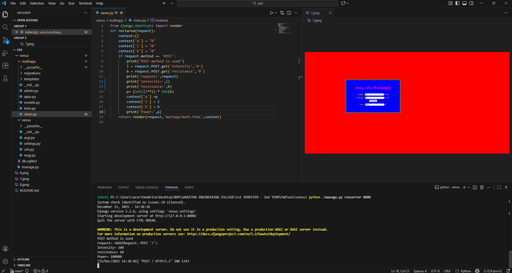
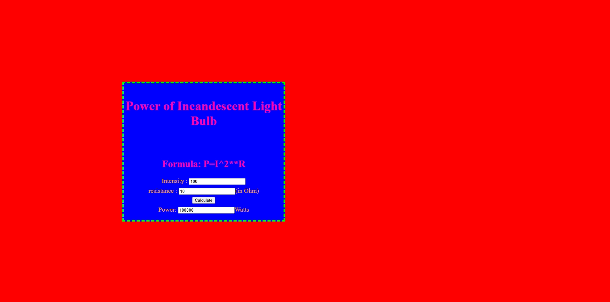

# Ex.05 Design a Website for Server Side Processing
## Date: 15.12.2025
## Reference no: 25002753

## AIM:
 To design a website to calculate the power of a lamp filament in an incandescent bulb in the server side. 


## FORMULA:
P = I<sup>2</sup>R
<br> P --> Power (in watts)
<br> I --> Intensity
<br> R --> Resistance

## DESIGN STEPS:

### Step 1:
Clone the repository from GitHub.

### Step 2:
Create Django Admin project.

### Step 3:
Create a New App under the Django Admin project.

### Step 4:
Create python programs for views and urls to perform server side processing.

### Step 5:
Create a HTML file to implement form based input and output.

### Step 6:
Publish the website in the given URL.

## PROGRAM :
```
math.html

<html>
<head>
<meta charset='utf-8'>
<meta http-equiv='X-UA-Compatible' content='IE=edge'>
<title>Area of Rectangle</title>
<meta name='viewport' content='width=device-width, initial-scale=1'>
<style type="text/css">
body
{
background-color:red;
}
.edge {
width: 1440px;
margin-left: auto;
margin-right: auto;
padding-top: 250px;
padding-left: 300px;
}
.box {
display:block;
border: Thick dashed lime;
width: 500px;
min-height: 300px;
font-size: 20px;
background-color:blue;
}
.formelt{
color:orange;
text-align: center;
margin-top: 7px;
margin-bottom: 6px;
}
h1,h2
{
color:rgb(255, 0, 179);
text-align: center;
padding-top: 20px;
}
</style>
</head>
<body>
<div class="edge">
<div class="box">
<h1>Power of Incandescent Light Bulb</h1><br>
<h2>Formula: P=I^2**R</h2>
<form method="POST">

<div class="formelt">
Intensity : <input type="text" name="Intensity" value="{{l}}"></input><br>
</div>
<div class="formelt">
resistance : <input type="text" name="resistance" value="{{b}}"></input>(in Ohm)<br>
</div>
<div class="formelt">
<input type="submit" value="Calculate"></input><br>
</div>
<div class="formelt">
Power: <input type="text" name="Power" value="{{p}}"></input>Watts<br>
</div>
</form>
</div>
</div>
</body>
</html>

views.py

from django.shortcuts import render
def rectarea(request):
    context={}
    context['p'] = "0"
    context['l'] = "0"
    context['b'] = "0"
    if request.method == 'POST':
        print("POST method is used")
        l = request.POST.get('Intensity','0')
        b = request.POST.get('resistance','0')
        print('request=',request)
        print('Length=',l)
        print('Breadth=',b)
        p= (int(l)**2) * int(b)
        context['p'] =p
        context['l'] = l
        context['b'] = b
        print('Area=',p)
    return render(request,'mathapp/math.html',context)

urls.py

from django.contrib import admin
from django.urls import path
from mathapp import views
urlpatterns = [
    path('admin/', admin.site.urls),
    path('areaofrectangle/', views.rectarea, name="areaofrectangle"),
    path('', views.rectarea, name="areaofrectangleroot")
]

```


## SERVER SIDE PROCESSING:


## HOMEPAGE:


## RESULT:
The program for performing server side processing is completed successfully.
